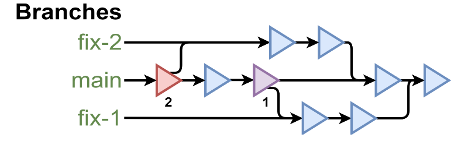
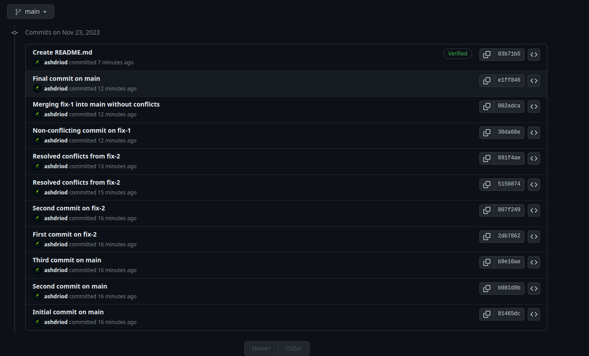
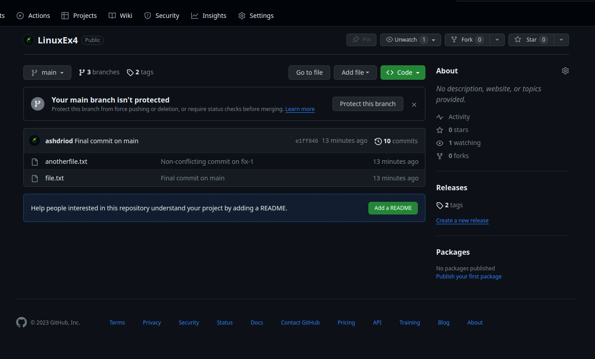

# Top Down

This repository was created for the operations as depicted in the following image:




## Commands Used

### Initialize Your Local Repository and Make the First Commit:

```bash
git init
git branch -m master main

echo "Initial content" > file.txt
git add file.txt
git commit -m "Initial commit on main"
```

### Create and Switch to the `fix-2` Branch:

```bash
git branch fix-2
```

### Make the Second and Third Commits on `main`:

```bash
echo "More content for main" >> file.txt
git add file.txt
git commit -m "Second commit on main"

echo "Even more content for main" >> file.txt
git add file.txt
git commit -m "Third commit on main"
```

### Create the `fix-1` Branch:

```bash
git branch fix-1
```

### Make the First and Second Commits on `fix-2`:

```bash
git checkout fix-2
echo "Conflicting content" > file.txt
git add file.txt
git commit -m "First commit on fix-2"

echo "More conflicting content" >> file.txt
git add file.txt
git commit -m "Second commit on fix-2"
```

### Merge `fix-2` into `main` with Conflict Resolution and Tag It:

```bash
git checkout main
git merge fix-2 -m "Merging fix-2 with conflicts into main"
# Manually resolve the conflicts in file.txt
git add file.txt
git commit -m "Resolved conflicts from fix-2"
git tag -a merge-2 -m "Tag for merge-2 after merging fix-2"
```

### Merge `fix-1` into `main` Without Conflict and Tag It:

```bash
git checkout fix-1
echo "Non-conflicting changes from fix-1" >> anotherfile.txt
git add anotherfile.txt
git commit -m "Non-conflicting commit on fix-1"

git checkout main
git merge fix-1 -m "Merging fix-1 into main without conflicts"
git tag -a merge-1 -m "Tag for merge-1 after merging fix-1"
```

### Make the Final Commit on `main`:

```bash
echo "Finalizing content on main" >> file.txt
git add file.txt
git commit -m "Final commit on main"
```

### Add Your GitHub Repository as a Remote and Push Everything:

```bash
git remote add origin https://github.com/ashdriod/LinuxEx4.git
git push -u origin main
git push origin fix-1
git push origin fix-2
git push --tags
```
# For Reference

The screenshots of the repository are as follows:




